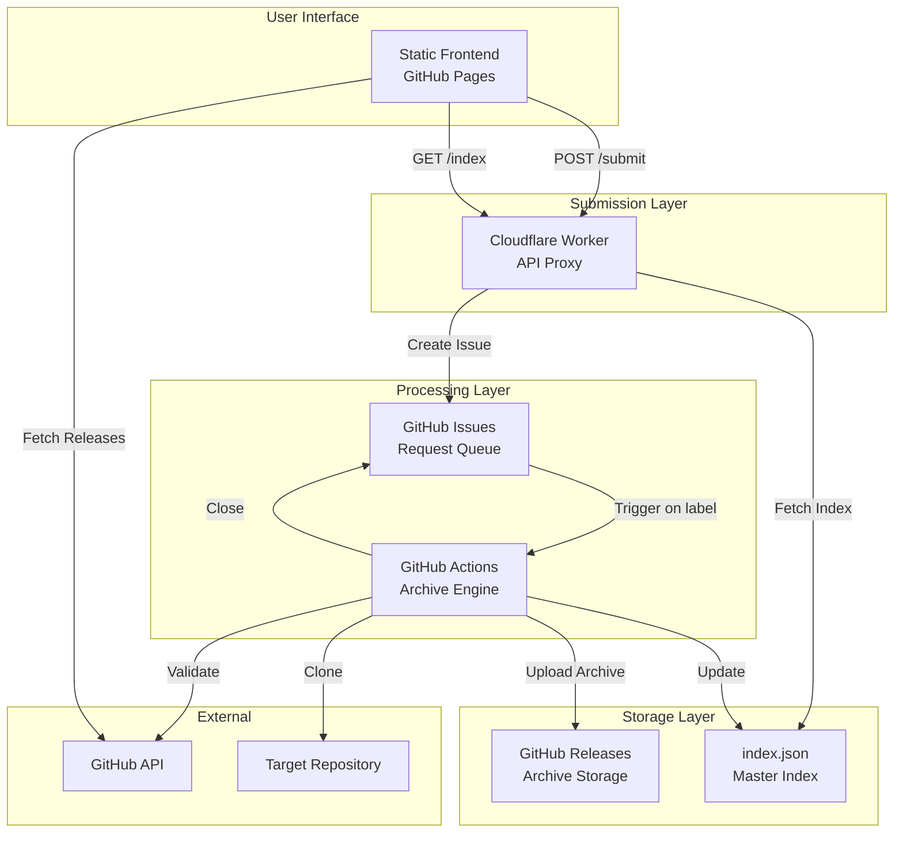
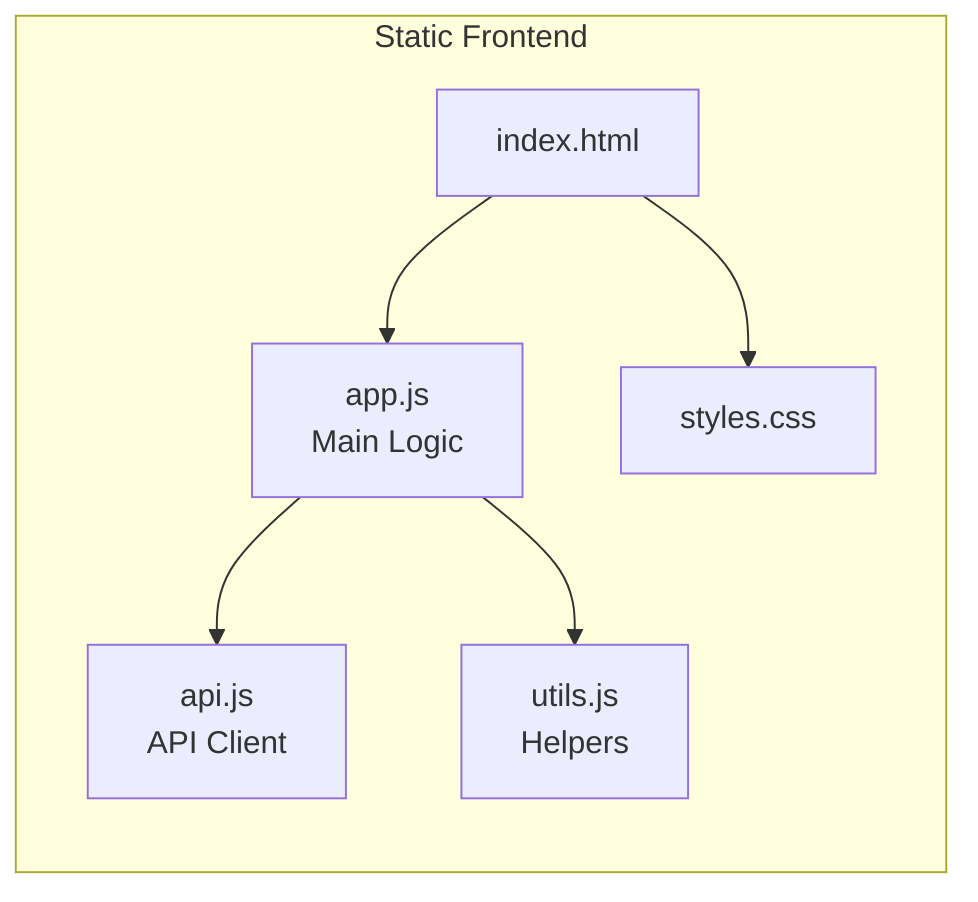
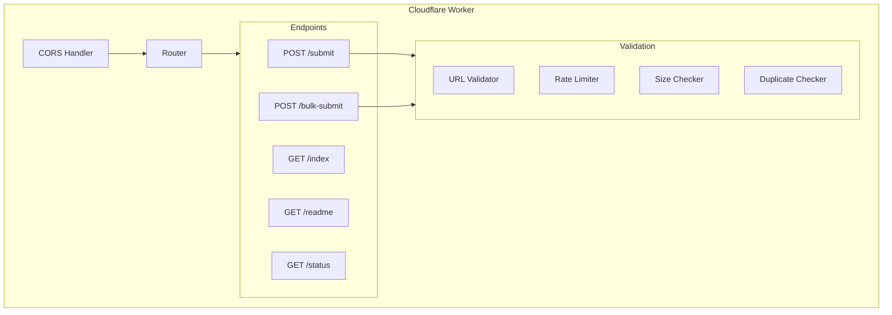
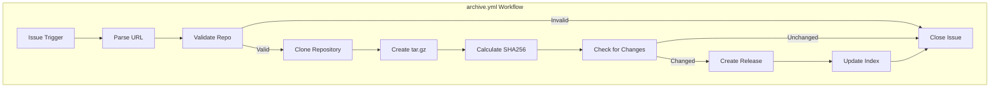
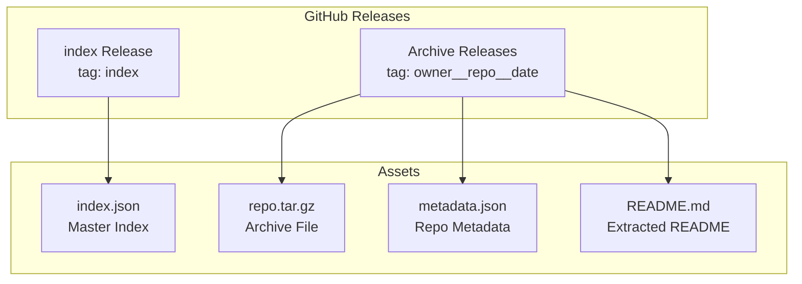
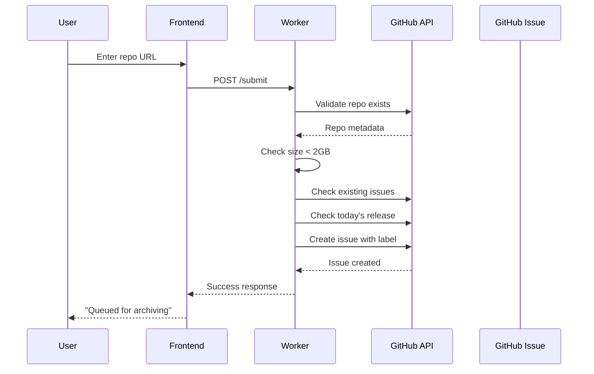
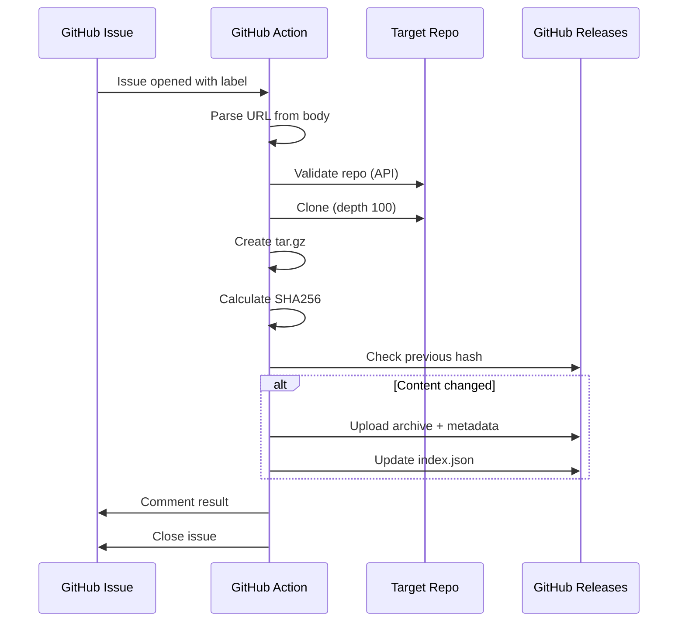

# Architecture

## System Overview

Git-Archiver Web is a serverless GitHub repository archiving service that I designed to run entirely on free-tier cloud services. The architecture prioritizes zero operational cost while maintaining reliability and scalability.

## Component Architecture

### Frontend Layer

The frontend is a single-page application built with vanilla JavaScript. I deliberately avoided frameworks to minimize bundle size and eliminate build steps. The entire frontend consists of:

- **index.html**: Semantic markup with accessibility considerations
- **styles.css**: Custom CSS with dark theme and responsive design
- **app.js**: Application state management and UI rendering
- **api.js**: API client abstracting all backend communication
- **utils.js**: Pure utility functions for formatting, validation, and DOM manipulation

### Worker Layer (Cloudflare)

The Cloudflare Worker serves as a secure proxy between the frontend and GitHub API. Key responsibilities:

1. **Token Protection**: GitHub PAT never exposed to client
2. **Request Validation**: URL format, size limits, duplicate checking
3. **Rate Limiting**: IP-based throttling (configurable via KV)
4. **CORS Handling**: Enables cross-origin requests from GitHub Pages
5. **Index Proxying**: Avoids CORS issues with GitHub release asset redirects

### Processing Layer (GitHub Actions)

I chose GitHub Actions as the archive engine because:

1. **Free compute**: Unlimited minutes for public repositories
2. **Native integration**: Direct access to GitHub API with built-in tokens
3. **Event-driven**: Triggers on issue creation without polling
4. **Reliable**: Managed infrastructure with automatic retries

### Storage Layer

## Key Architecture Decisions

### Why Serverless?

I chose a serverless architecture for several reasons:

1. **Zero maintenance**: No servers to patch, scale, or monitor
2. **Cost efficiency**: All services operate within free tiers
3. **Global distribution**: Cloudflare and GitHub CDN provide edge caching
4. **Automatic scaling**: Handles traffic spikes without configuration

### Why GitHub Issues as Queue?

Using GitHub Issues as a job queue was an unconventional but effective choice:

1. **Visibility**: Users can track their request status
2. **Auditability**: Complete history of all archive requests
3. **Native triggering**: GitHub Actions can trigger on issue events
4. **No additional services**: Eliminates need for Redis, SQS, etc.

### Why GitHub Releases for Storage?

1. **Unlimited storage**: No stated limits for public repos
2. **CDN-backed**: Fast downloads globally
3. **Versioning**: Natural support for multiple archive versions
4. **API accessible**: Easy programmatic access to assets

### Deduplication Strategy

I implemented content-based deduplication using SHA256 hashes:

1. Each archive's hash is stored in metadata.json
2. Before creating a new release, the workflow compares hashes
3. If unchanged, no new release is created (saves storage)
4. Daily update job re-archives repos only when content changes

### Security Considerations

1. **Token isolation**: GitHub PAT stored in Cloudflare secrets, never in frontend
2. **Input sanitization**: Strict URL regex validation
3. **XSS prevention**: All user input escaped before rendering
4. **Rate limiting**: Prevents abuse of submission endpoint
5. **Size limits**: 2GB cap prevents storage abuse

## Data Flow

### Submission Flow

### Archive Flow

## Limitations

1. **Repository size**: 2GB maximum (GitHub release asset limit)
2. **Clone depth**: Limited to 100 commits for speed
3. **Private repos**: Not supported (intentional)
4. **Rate limits**: 10 requests/hour per IP (configurable)
5. **GitHub dependency**: Entire system relies on GitHub availability
