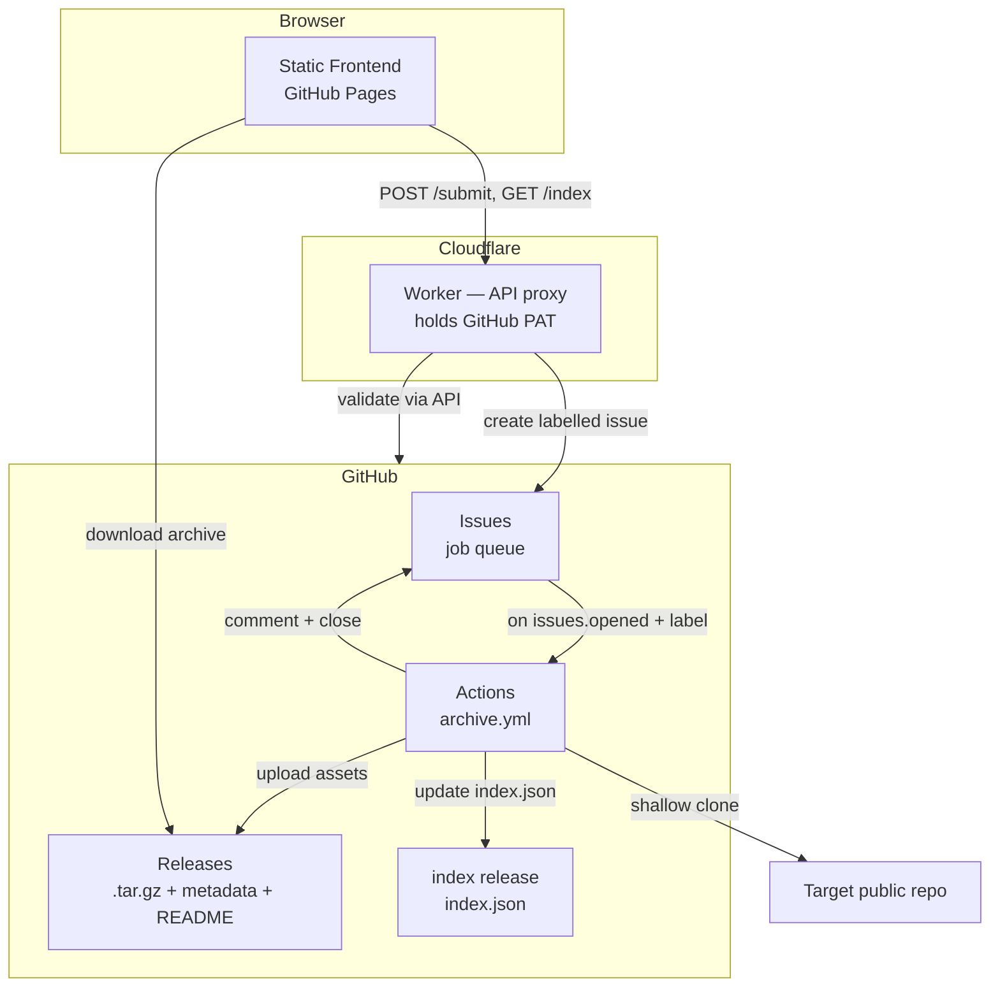
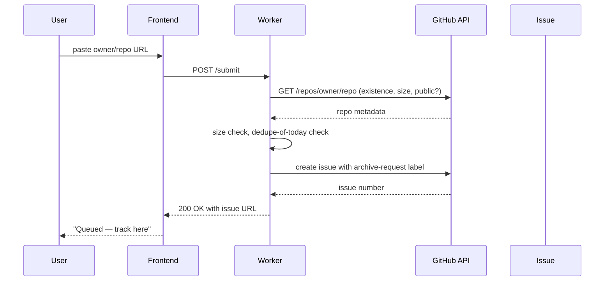
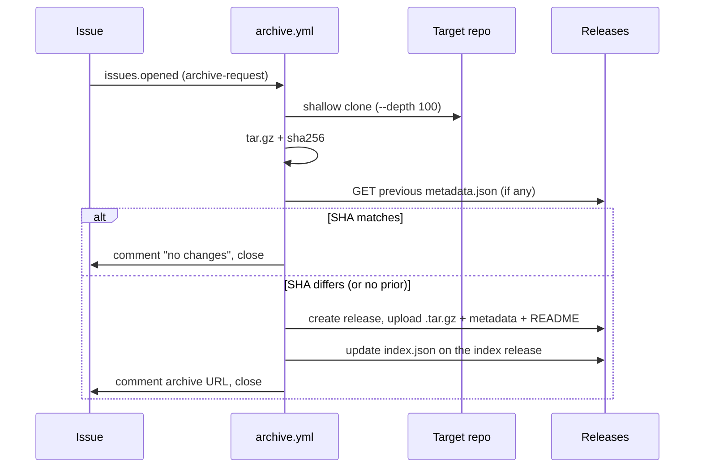

# Architecture

## System Diagram

```mermaid
flowchart TB
    subgraph Browser["Browser"]
        FE[Static Frontend<br/>GitHub Pages]
    end

    subgraph CF["Cloudflare"]
        CW[Worker — API proxy<br/>holds GitHub PAT]
    end

    subgraph GH["GitHub"]
        GI[Issues<br/>job queue]
        GA[Actions<br/>archive.yml]
        GR[Releases<br/>.tar.gz + metadata + README]
        IDX[index release<br/>index.json]
    end

    REPO[Target public repo]

    FE -->|POST /submit, GET /index| CW
    CW -->|validate via API| GH
    CW -->|create labelled issue| GI
    GI -->|on issues.opened + label| GA
    GA -->|shallow clone| REPO
    GA -->|upload assets| GR
    GA -->|update index.json| IDX
    GA -->|comment + close| GI
    FE -->|download archive| GR
```

## Component Descriptions

### Frontend (`frontend/`)
- **Purpose**: User-facing UI for submitting URLs, browsing archives, and previewing READMEs.
- **Location**: `frontend/index.html`, `frontend/about.html`, `frontend/js/app.js`, `frontend/js/api.js`, `frontend/js/utils.js`.
- **Key responsibilities**: form validation, rendering the repo grid, opening the detail modal, debounced search, talking to the worker over fetch.
- **Notes**: Vanilla JS, no framework, no build step. Deployed by `pages.yml` on every push to main.

### Worker (`worker/src/index.js`)
- **Purpose**: Token-isolating API proxy between the static frontend and GitHub.
- **Location**: `worker/src/index.js` (~1.2k lines), deployed via Wrangler.
- **Key responsibilities**:
  - URL parsing and validation
  - GitHub API calls (repo metadata, existence, size)
  - Duplicate-submission checks (open issues today, existing release for today)
  - Creating labelled archive-request issues
  - Proxying `index.json` and archived READMEs to dodge CORS
  - Rate-limit hooks (wired for Cloudflare KV)
- **Notes**: Single-file Worker, no runtime dependencies. Holds `GITHUB_TOKEN`, `GITHUB_OWNER`, `GITHUB_REPO` as Wrangler secrets.

### Archive workflow (`.github/workflows/archive.yml`)
- **Purpose**: Clone the target repo, build the archive, dedupe, and publish.
- **Location**: `.github/workflows/archive.yml` (~800 lines).
- **Key responsibilities**:
  - Triggered on `issues.opened` with the `archive-request` label
  - Parse the URL out of the issue body
  - Validate the repo via the GitHub API (still public, size under 2 GB)
  - Shallow-clone with `--depth 100`
  - Produce `owner_repo.tar.gz`, `metadata.json` (size, SHA-256, stars, default branch, archive date), and extract `README.md`
  - Compare SHA-256 against the previous release's metadata
  - Publish a new release tagged `owner__repo__YYYY-MM-DD` only if content changed
  - Update `index.json` on the `index` release
  - Comment status back on the originating issue and close it

### Daily refresh (`.github/workflows/update-archives.yml`)
- **Purpose**: Re-archive the oldest entries on a schedule, picking up new commits.
- **Location**: `.github/workflows/update-archives.yml`.
- **Key responsibilities**: cron-triggered, picks N oldest entries from `index.json`, dispatches `archive.yml` per entry. The SHA-256 dedupe in `archive.yml` ensures only actually-changed repos produce new releases.

### Pages deploy (`.github/workflows/pages.yml`)
- **Purpose**: Deploy `frontend/` to GitHub Pages on every push to main.
- **Location**: `.github/workflows/pages.yml`.

### Setup scripts (`scripts/`)
- **Purpose**: One-off bootstrap and recovery.
- **Location**: `scripts/setup.sh`, `scripts/create-index.sh`, `scripts/restore-index.sh`.
- **Key responsibilities**: create the initial `index` release, rebuild `index.json` from existing releases if it gets corrupted, and walk a new operator through the required secrets.

## Data Flow — submission

```mermaid
sequenceDiagram
    participant U as User
    participant F as Frontend
    participant W as Worker
    participant G as GitHub API
    participant I as Issue

    U->>F: paste owner/repo URL
    F->>W: POST /submit
    W->>G: GET /repos/owner/repo (existence, size, public?)
    G-->>W: repo metadata
    W->>W: size check, dedupe-of-today check
    W->>G: create issue with archive-request label
    G-->>W: issue number
    W-->>F: 200 OK with issue URL
    F-->>U: "Queued — track here"
```

## Data Flow — archive

```mermaid
sequenceDiagram
    participant I as Issue
    participant A as archive.yml
    participant R as Target repo
    participant S as Releases

    I->>A: issues.opened (archive-request)
    A->>R: shallow clone (--depth 100)
    A->>A: tar.gz + sha256
    A->>S: GET previous metadata.json (if any)
    alt SHA matches
        A->>I: comment "no changes", close
    else SHA differs (or no prior)
        A->>S: create release, upload .tar.gz + metadata + README
        A->>S: update index.json on the index release
        A->>I: comment archive URL, close
    end
```

## External Integrations

| Service | Purpose | Notes |
|---------|---------|-------|
| GitHub REST API | Repo metadata, releases, issues, index updates | Authenticated with a PAT held in Cloudflare Worker secrets |
| GitHub Pages | Frontend hosting | Free, served from `frontend/` |
| Cloudflare Workers | API proxy + token isolation | 100K req/day free tier; sub-5ms cold start |

## Key Architectural Decisions

### Issues as the job queue
- **Context**: Needed a durable, observable, free queue.
- **Decision**: GitHub Issues with an `archive-request` label, triggering `archive.yml` on `issues.opened`.
- **Rationale**: Rejected Redis-on-a-VM (costs money, needs babysitting) and Cloudflare Queues (would still need polling glue). Issues come with a UI, comment thread, search, and webhook hooks for free. The trade-off is being tied to GitHub's webhook latency, which doesn't matter for a workflow that takes minutes.

### Worker between frontend and GitHub
- **Context**: The PAT cannot ship to the browser, and the frontend needs CORS-friendly endpoints.
- **Decision**: A Cloudflare Worker holds the token and proxies everything.
- **Rationale**: Rejected hosted backends (Render, Fly) because they need a paid plan for always-on, and AWS Lambda + API Gateway because of the config sprawl. Workers give global edge, free tier, and built-in secrets — the right shape for a one-file proxy.

### `index.json` as a release asset, not a database
- **Context**: The frontend needs a list of every archived repo to render the grid, search, and detail modals.
- **Decision**: Publish a single `index.json` as an asset on a release tagged `index`. Update it as the last step of every archive run.
- **Rationale**: A real database (D1, KV, Supabase) would mean a second service to provision and pay for. The index is small (kilobytes per entry), append-mostly, and read-heavy — exactly what a CDN-fronted blob is good at. The cost is having to serialize writes through the archive workflow, which is fine because submissions are already serialized through the issue queue.

### SHA-256 content dedupe
- **Context**: Daily refreshes plus user-triggered re-archives would otherwise pile up duplicate releases.
- **Decision**: Hash the produced `.tar.gz` and compare against the previous release's `metadata.json`. Only publish on a mismatch.
- **Rationale**: Comparing on git SHAs is unreliable because shallow clones and timestamps make the tarball non-deterministic in ways that aren't reflected in commit SHAs. Hashing the output is exact and trivial to implement in the workflow.

### Shallow clone with depth 100
- **Context**: Some repos have decades of history; a full clone can take many minutes and blow past the 2 GB asset cap.
- **Decision**: `git clone --depth 100`.
- **Rationale**: 100 commits keeps recent context for users who want to inspect history without dragging in the full git database. Users who need true mirrors are better served by `git clone --mirror` themselves; this service is about the working tree.

## Limitations

1. **2 GB per archive** — GitHub Releases' per-asset cap.
2. **Shallow history** — `--depth 100`, not a full mirror.
3. **Public repos only** — by design.
4. **GitHub dependency** — frontend, queue, compute, and storage all live on GitHub. If GitHub changes its terms around release storage or public-repo Actions minutes, the architecture would need to change.
5. **Webhook-bound latency** — submissions land in a queue that runs on GitHub's webhook schedule, not instantly.
